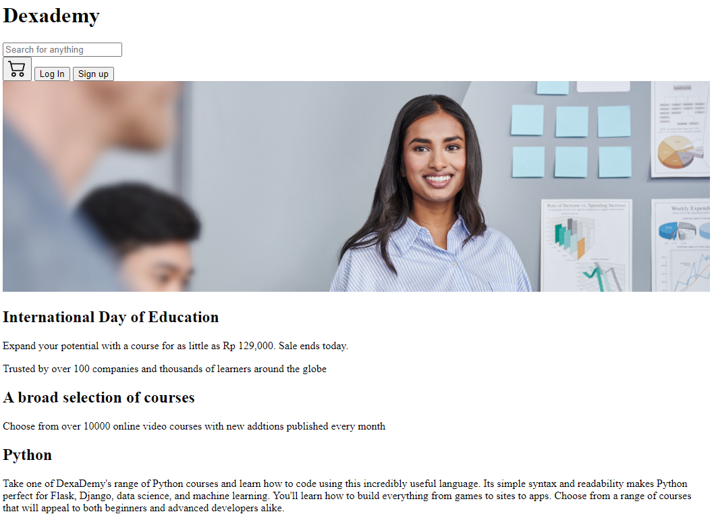
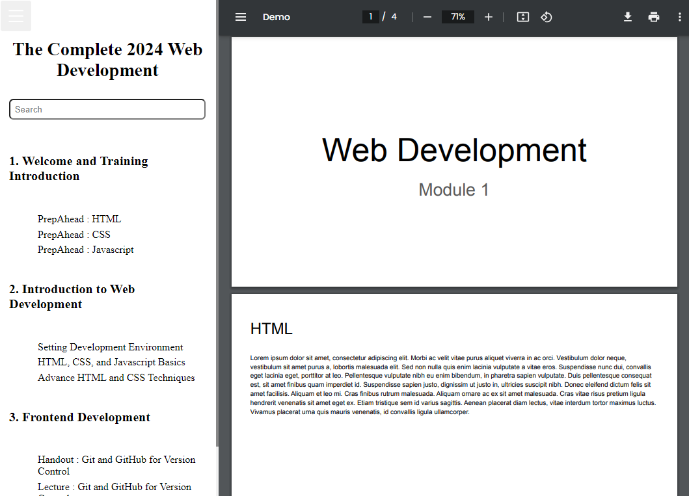
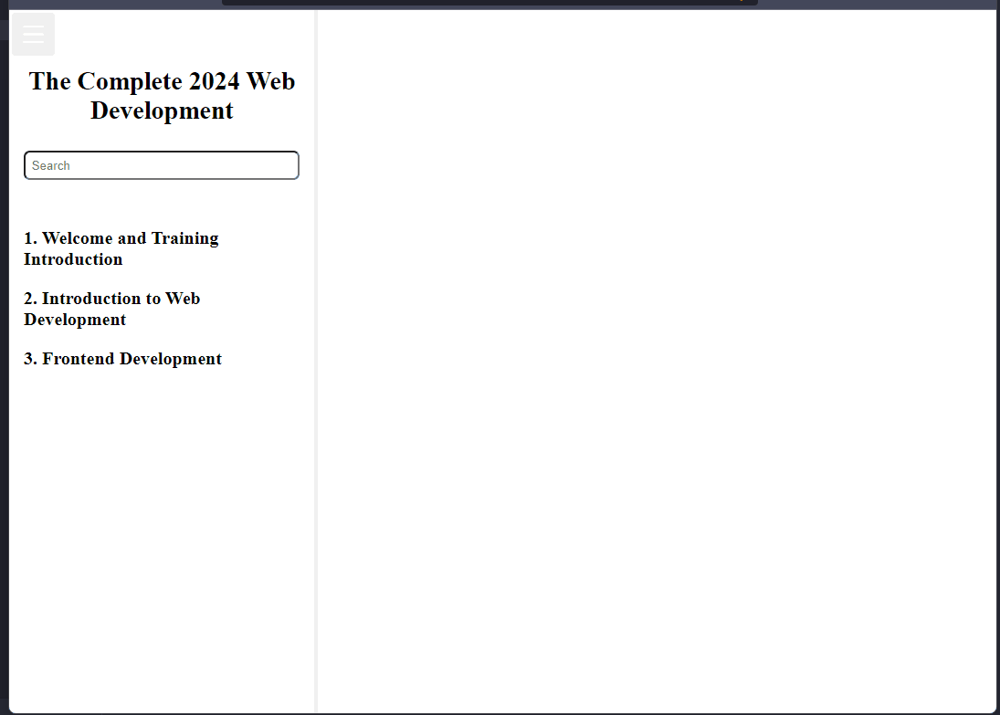
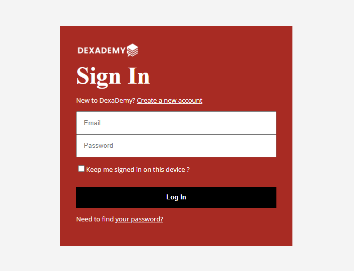
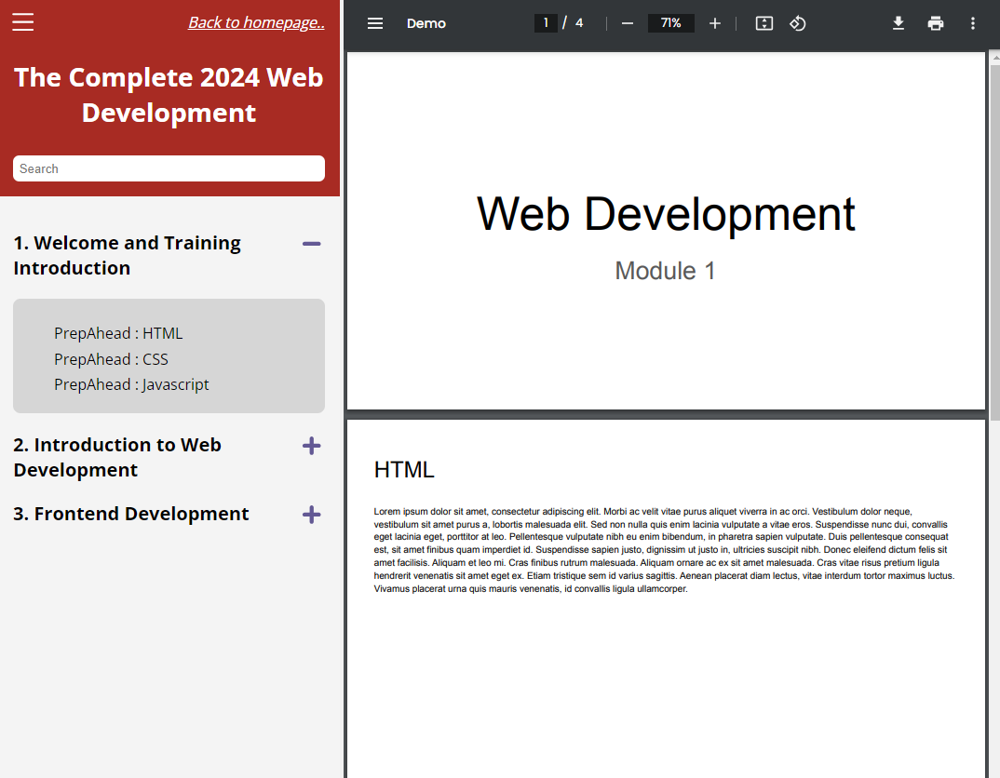

# revou-web-dev-milestone-project-1-alwan

## Description

This is the first milestone project for "Web Development" module from RevoU. This is a website inspired from Dexa and various learning platform. This is my answer of "What if Dexa create a learning platform ?". There are three page :

1. Login Page
2. Home Page
3. Learning Page

## How to run

### Home page

Open index.html on browser to access home page.

### Login Page

Click "Log In" button on header to open login page.

### Learning Page

Choose an item in "Learners Are Viewing" section to open learning page.

## Development

1. Content and layouting
   
   

2. Component function
   

3. Styling page
   
   
   

4. Adjust Responsiveness
   
